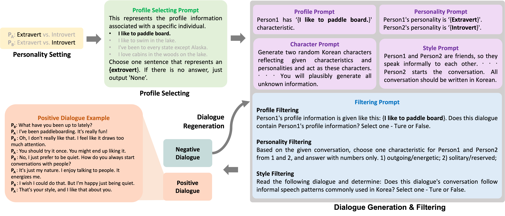

# PSYDIAL
Code for a paper "[PSYDIAL: Personality-based Synthetic Dialogue Generation using Large Language Models](https://arxiv.org/abs/2404.00930)" accpeted in LREC-COLING 2024 Main


## Personality-based Synthetic Dialogue Generation Pipeline

* STEP 1 - Personality Setting
* STEP 2 - Profile Selecting
* STEP 3 - Dialogue Generation
* STEP 4 - Dialogue Filtering
* STEP 5 - Dialogue Regeneration


## Data files
* `5_personality.csv`     
  This file contains descriptions from 5 dimensions of Big five personality. It is utilized to set the personality of two speakers in `STEP 1 (Personality Setting)`.
* `personaChat_personality_origin.csv`     
  This file contains persona information from PersonaChat dataset. It is utilized in `STEP 2 (Profile Selecting)`.

## Code
:exclamation: You need an Open AI API key to execute the pipeline. :exclamation:

* `main_pipeline.py`   
  The main pipeline through STEP 1 to a part of STEP 4 is implemented in this file.
* `main_filtering.py`   
  Part of STEP 4 (Dialogue Filtering) is implemented in this file. It filters generated dialogues.
* `main_regeneration.py`     
  This file is about STEP 5 (Dialogue Regeneration). It regenerates a dialogue filtered as a negative dilaogue.

## Citation
```
@misc{han2024psydial,
      title={PSYDIAL: Personality-based Synthetic Dialogue Generation using Large Language Models}, 
      author={Ji-Eun Han and Jun-Seok Koh and Hyeon-Tae Seo and Du-Seong Chang and Kyung-Ah Sohn},
      year={2024},
      eprint={2404.00930},
      archivePrefix={arXiv},
      primaryClass={cs.CL}
}
```
